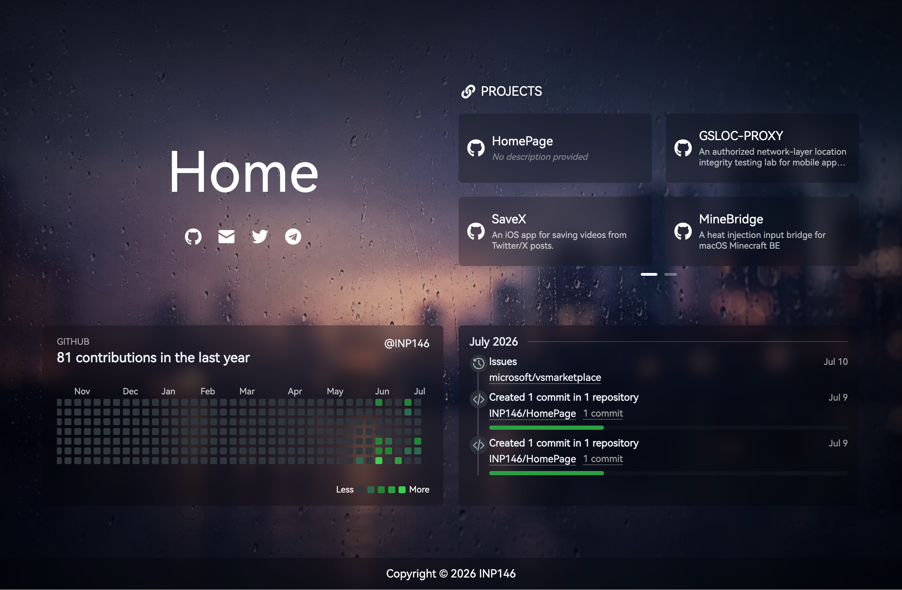

# HomePage

A developer-focused personal homepage built with Vue 3. It brings together projects, a GitHub contribution graph, and recent public GitHub activity in a responsive, PWA-enabled interface.

<p><b>English</b> | <a href="README.zh-CN.md">简体中文</a></p>



> This is a secondary development of [imsyy/home](https://github.com/imsyy/home). The music player, weather, time capsule, Hitokoto, and settings modules from the upstream project have been removed in favor of project and GitHub data presentation.

## Features

- Random local wallpapers and a loading animation
- Configurable site identity, social links, and ICP registration
- Combined GitHub pinned repositories and local project links
- GitHub contribution graph for the last year
- Recent public GitHub activity timeline
- Paginated project cards, mouse-wheel navigation, and responsive mobile layouts
- PWA asset caching and update notifications

## Stack

- [Vue 3](https://vuejs.org/) + [Vite](https://vitejs.dev/)
- [Pinia](https://pinia.vuejs.org/)
- [Element Plus](https://element-plus.org/)
- [Swiper](https://swiperjs.com/)
- [vite-plugin-pwa](https://vite-pwa-org.netlify.app/)
- [Cloudflare Workers](https://workers.cloudflare.com/) (optional, for GitHub GraphQL data)

## Run Locally

Node.js 18 or later is recommended.

```bash
# Install dependencies
pnpm install

# Start the development server (port 3000 by default)
pnpm dev

# Create a production build
pnpm build

# Preview the production build
pnpm preview
```

The static output is written to `dist/` and can be deployed to any static hosting provider.

## Configure the Site

The application reads configuration from the root `.env` file. Restart the development server or rebuild after changing it.

```dotenv
# Site information
VITE_SITE_NAME="Home"
VITE_SITE_AUTHOR="INP146"
VITE_SITE_KEYWORDS="INP146,INP"
VITE_SITE_URL="inp.la"
VITE_SITE_LOGO="/images/icon/favicon.ico"
VITE_SITE_MAIN_LOGO="/images/icon/logo.png"
VITE_SITE_APPLE_LOGO="/images/icon/apple-touch-icon.png"

# GitHub data API; the code has a default when it is omitted
VITE_GITHUB_API="https://gh-api.inp.la/"

# ICP registration; leave empty to hide it
VITE_SITE_ICP=""
```

The GitHub username is first resolved from the `Github` entry in `src/assets/socialLinks.json`, then falls back to `VITE_SITE_AUTHOR`.

### Social Links

Edit `src/assets/socialLinks.json`. Each entry has a label, icon path, and URL:

```json
{
  "name": "Github",
  "icon": "/images/icon/github.png",
  "url": "https://github.com/your-account"
}
```

### Project Links

Edit `src/assets/siteLinks.json` to add projects. The page fetches GitHub pinned repositories first, then merges and de-duplicates these local entries by link.

```json
{
  "icon": "Github",
  "name": "My Project",
  "description": "A short project description.",
  "link": "https://github.com/your-account/my-project"
}
```

`icon` may be one of `Github`, `Blog`, `Cloud`, `CompactDisc`, `Compass`, `Book`, `Fire`, or `LaptopCode`. It can also be an image URL, a `data:` URL, or an image path under `public/`.

### Wallpapers and Icons

- Put wallpapers in `public/images/` as `background1.jpg` through `background4.jpg`; the current component selects one at random.
- Site icons live in `public/images/icon/`. Replace the files or update the paths in `.env`.

## GitHub Data

The page uses the following sources:

| Content             | Source                                          | Notes                                                                                                          |
| ------------------- | ----------------------------------------------- | -------------------------------------------------------------------------------------------------------------- |
| Pinned repositories | Worker at `VITE_GITHUB_API`                     | Reads GitHub GraphQL pinned repositories. Local project links remain available when the Worker is unavailable. |
| Contribution graph  | Worker, then a public contribution API fallback | Shows the past 365 days; an empty calendar is shown when no data is available.                                 |
| Public activity     | GitHub REST API                                 | Fetches recent public events directly and displays up to three.                                                |

The Worker source is at `workers/github-pinned-repos.js`. It accepts `type=pinned` or `type=contributions`, `username`, and an optional `limit`. Configure these Worker environment variables:

```text
GITHUB_TOKEN=GitHub personal access token
GITHUB_USERNAME=default GitHub username
```

Deploy the Worker to Cloudflare and set `VITE_GITHUB_API` to its public URL. Never expose `GITHUB_TOKEN` to the browser. Public GitHub activity and the contribution fallback can be affected by API availability, networking, and rate limits.

## Docker

```bash
# Build and run
docker compose up --build -d
```

The container listens on port `12445`: `http://localhost:12445`.

Or use Docker directly:

```bash
docker build -t home .
docker run --rm -p 12445:12445 home
```

## Acknowledgements, Copyright, and License

This project is a secondary development of [imsyy/home](https://github.com/imsyy/home). Thanks to the original author, [imsyy](https://github.com/imsyy), for the open-source project and design foundation. This repository is not an official upstream release.

Copyright ownership is declared as follows:

```text
Copyright (c) 2022 imsyy              # Upstream project and retained original content
Copyright (c) 2026 @INP146            # Secondary development in this repository
```

Redistributions of this project or substantial portions of it must retain both copyright notices and the full [MIT License](./LICENSE).

Unless otherwise noted, this project and the retained upstream code are released under the [MIT License](./LICENSE), and are provided "as is" without warranty of any kind.
